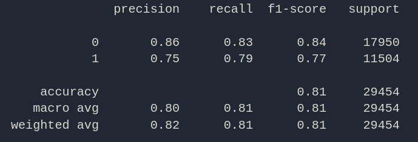

# This model predicts whether a person is male of female by taking their name as input

#### Test Accuracy - 81%
#### Train Accuracy - ~ 84% (Stopped Early)

# Notes -

- While training and testing it was seen when vocab had capital letters it perfomed slightly better (f1-score of males increased by one) compared to using only lowercase letters
  
- Compared it to a KNN model (Accuracy 66%-67%).

- Made two functions of getting the classification score test_model_stats(model) and predicting whether a name given by a user is male or female predict_gender(model)

- 1 is male and 0 is female

- Has a tendency of labelling male as female

# Current Stats -

